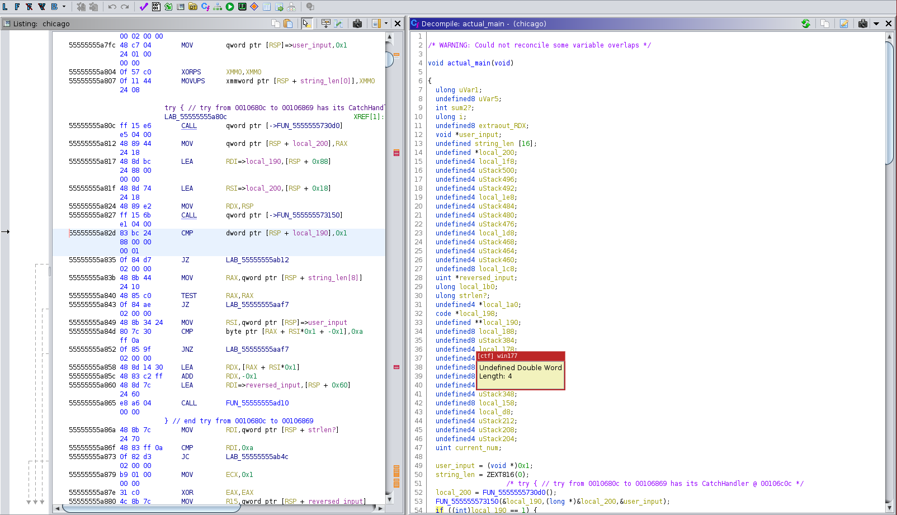
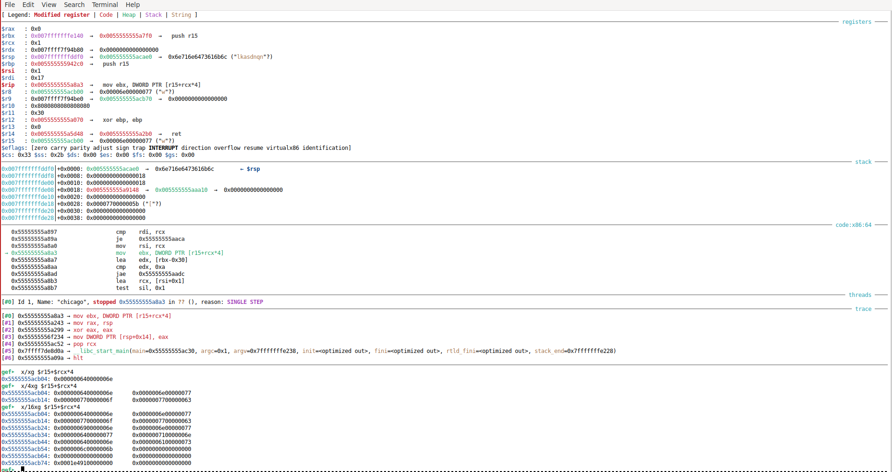

### Writeup for chicago

* First look at the binary + grepping for possible flags embedded
in it shows that it's stripped....and doesn't have a trivial solution
inside of it.


* Looks like there are a few checks on what gets passed in stdin.


* Run this in GDB, and hit Ctrl-C and then ```ni``` to read
input without immediately continuing


* Using the backtrace will help figure out what functions get 
invoked on the way to reading from stdin as well as where the checks
might be. Sync ghidra with GDB by rebasing the binary to match the base
that GDB uses. This can be done with ```Window``` -> ```Memory map```
-> ```Set Image Base``` (the home icon)

* With some trial and error, it appears that function number 4 in
the backtrace (```0x000055555555a82d``` this example) may have the checks
needed. In the decompilation below, it's been renamed to ```actual_main```



* Break at the next address in our 'target' function, 0x55555555a835


 
* Observe a PTR to the input in rsp

Stepping a few more instructions, here is a check that the last character
in the string == ```'\n'```


Stepping a few more instructions gets to a call into a function
with _very_ ugly decompilation. Best to step over it for now
and see if we can determine how important it is based
on how its result is used.


After stepping over the call and going to the
```cmp``` instruction, notice the 0x9 to
0xa comparison.


 0x9 is the length of our
input, which indicates that the strange function
handles this length check (it does more than that... but hold for later):

```
 if numbers.len() < 10{
        panic!("Bad length");
    }
```


Hitting continue will trigger a panic,
so re-run with different string >= 10 bytes not including a newline char


After doing so, stepping past the length comparison
brings us to a possible loop (note that strlen == 0x17 in this example)


Stepping further, rcx is used to index into  our input,
but split into a series of 4 byte integers _and_
reverses it.




Step a few more instructions, and see that each character
is subtracted by 0x30 and checked against 0xa. 
Step a bit more, and the program panics, as the ```jae``` check
doesn't get passed.


Look at the ASCII table and see that the only characters that can 
meet this constraint are the numbers 0-9. Attempting to use
characters like ```/``` will underflow, which won't pass the 
```jae``` check either.


Re-run the program, I used ```1234567890987654321``` in this example.
Setting good breakpoints would be a good idea here....

After passing the previously-failed check, we land at another
that determines if our counter is an odd or even number


Stepping a few more instructions shows another check,
is our current digit > 0x35 ('4' in ASCII) ?


Since '2' < '4' AND our counter (we'll call it ```i```) is
odd , we add 0x4 (result of ```add edx, edx```) to rax


Going to the next iteration, ```i``` == 2,
so we jump to a different branch that adds our value (0x3)
directly to rax.


Continuing a few more iterations until we hit '6' gives a new branch,
since the 'is our current digit > 0x35' check is met and ```i```== 5.


This part is diffcult to figure out, but with some trial and error
it can be shown that it takes the digit (0x6 in our case), and multiples
it by 2, then takes that result and adds the '1' and '2' from '12' (decimal result)
and saves it in rsi.


Stepping further shows that this result gets added into our 'sum' saved
in RAX


Going back to ghidra can help with understanding the overall loop logic,
but the decompilation does _not_ make the multiplication + parsing
two digits step clear at all.


At this point, we can continue until hitting the check at ```55555555a8e7```
which takes us to a new branch.


Which corresponds to this section in ghidra:


Note that the last character in our original number is not used in the 'sum' calculation, explaining
why ```i``` started at 1 (counting from right to left).


I'd recommend using the decompilation output for calculating this final check,
the assembly instructions IMO don't make it as clear.

In summary, here are the requirements needed for the flag:

	- Strlen >= 10 (not including a newline char)
	- reverse the input
		- for i in 1 to string length:
			- if i is even, add current digit to sum
			- if i is odd
				- if current digit*2 >=10, add first and second digit to the sum
				- else, add current digit *2
	- Last digit _must_ == ```(((sum / 10) * 10 - sum) + 10) % 10)```

This is [Luhn algorithm](https://en.wikipedia.org/wiki/Luhn_algorithm)


* This can be implemented in C and solved with KLEE:

```
#include "klee/klee.h"
#include <stdlib.h>
#include <stdio.h>
#include <string.h>

int check(char* number){
	//copy reversed string into target
	int len = strlen(number);
	if(len == 0 || len < 10){
		return 0;
	}
	int j;
	char target[len+1];
	int k = 0;
	for(j = len-1; j>=0;j--){
		target[k] = number[j];
		k++;
	}//reverse the string
	target[len] = 0;

	//return 0 ==  bad check, 1 == correct
	
	int i = 1; //start at 1 to go from left-to-right in the original, last digit is the 'check' digit
	int sum = 0;
	int check_digit = 0;
	while(target[i] != 0){
		int current_number = (target[i]-0x30);
		if(current_number  < 0x0 || current_number > 0x9){
			return 0;
			
		}
		if(i%2 != 0){
			if(current_number*2 >=10){
				int first_digit = (current_number*2)/10;
				int second_digit = (current_number*2)%10;
				sum += (first_digit+second_digit);
			}	
			else{
				sum += current_number*2;
			}

		}
		else{
			sum += current_number;
		}
		if(target[i+1] == 0){
			break;
		}
		i++;
	}
	check_digit = (target[0]-0x30);
	int calc  = (10-(sum%10))%10;
	if(calc == check_digit){
		return 1;
	}
	return 0;
}


int main(int argc, char*argv[]){
	
	check(argv[1]);

}
```

* Save the above to ```solve.c```


* Set up a docker container for KLEE with the following 

* Use the following command to compile solve.c (changing the ```-I``` flag depending on its location to your CWD):

``` clang-11 -I ../../include -emit-llvm -c -g -O0 -Xclang -disable-O0-optnone solve.c```


* Run klee with ``` klee  --only-output-states-covering-new  --libc=uclibc --posix-runtime solve.bc --sym-arg 12``` 

and replay the tests with ```klee-replay ./solve ./<KLEE OUTPUT TEST DIR GOES HERE>/*.ktest```

* Select any of the numbers that are at least 10 chars long.....and the flag is ```bctf{s7r1pp3d_ru57_15_a_p41n_1n_th3_n3ck}```

